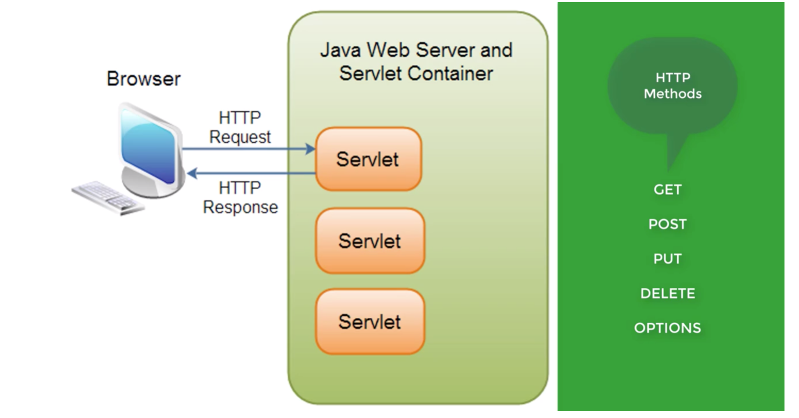

# TOMCAT - OVERVIEW 

  

## TOPICS COVERED 

1. What is rule of Tomcat as Java based web server 
2. Installation (Linux or Windows)
3. Features of Manager applicaiton 
4. Different ways of Deploying Applications
5. TomCat File structure
6. Security features
7. User creation
8. Role Creation
9. Configure SSL key
10. Creating Self Signed SSL Certificates
11. Enabling SSL for Web Applications 
12. Configuring SSL Certificates
13. Realms
14. Valves
15. High Availabiliy Cluster using X nodes and Nginix Load Balancer
16. Session Replication & its management in Cluster
17. Various Strategies of Session management 
18. How to use Tomcat as Virtual hosting Environment create virtual host, make tomcat run as vs server
19. HOST MULTIPLE WEBSITE ON SINGLE RESOURCE
20. Log Generation and Customization 
21. Local Framework used for logging 
22. Tuning and Performance Stuff

# OVERVIEW OF SERVLETT CONTAINER

  

## CORE FEATURE -  HTTP REQ/RESP MODEL

1. A request made for any dynamic web resource like a JSP Servlet 
2. Servlet is a Specialised JAVA CLASS 
2.1 Handles http requests like GET, POST, PUT etc

  
  
3. If the resource called is a JSP - it is translated and compiled into a Servlet before being executed by the container  

## TOMCAT COMPONENTS

For End to End Lifecycle Execution Various Components are Required.

  

## CATALINIA 

- Core container, does init(), Service() , destroy()
- MAIN ROLE - CONTROL LIFECYCLE 
- By Loading, Initializing, Serving and Destroying the Servlet as per Java Specification of JSP and Servlets 
- Manages the whole Bean Lifecycle - it is the core component.

## JASPER 

- JSP Engine
- Converts JSP pages/code to Servlets 
- This happens before servicing the request 
- So if you change JSP mid flight, Jasper can potentially generate the updated servlet in time for the response 

## COYOTE
- Connector component 
- Listens to TCP/IP ports to transmit web requests to container and end users
- Vital in integration with other Web Servers and providing Static Content
- Vital in running the applicaiton on SSL
 
## CLUSTER
- Important whilst running in distributed mode 
- Added to manage large applications 
- Used for load balancing via many techniques 

## Manager Application

 

## FILE SYSTEM 

 

